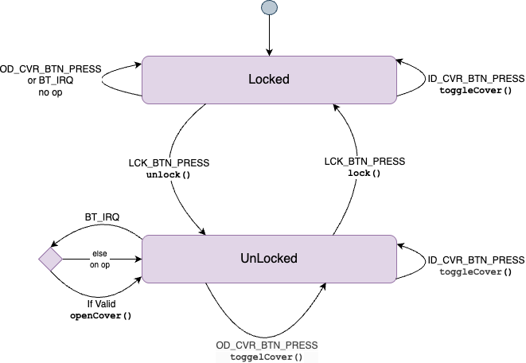

# Garage Door Controller

A garage door controller for the side door. It lets you open the door without leaving the mower: a Bluetooth remote on the mower sends a secure signal and, when nearby and the door is unlocked, the door opens automatically. A push button by the door also opens it when unlocked. The door must be unlocked from the inside; after unlocking it will automatically re-lock after a few hours. Attempts to open the door from outside while locked are ignored.

The drawing below shows the different components of the controller.

Outside

* **Cover Button**
  * press to open/close door
  * only works when unlocked
  * green LED is on when unlocked to indicate the button is enabled

Inside

* **Lock Button**
  * press to lock/unlock the door
  * red LED is on when unlocked
* **Cover Button**
  * press to open/close door
  * always works even when locked b/c we are inside
  * green LED is always on to indicate the button is enabled and the system is healthy
  * green LED blinks on startup until system is healthy

## State Diagram

Events

* **LCK_BTN_PRESS** - Lock Button Press
* **OD_CVR_BTN_PRESS** - Outdoor Cover Button Press
* **ID_CVR_BTN_PRESS** - Indoor Cover Button Press
* **BT_IRQ** - Bluetooth IRQ event occurs when a BT signal is near

Functions

* unlock()
  * set `isLocked=False`
  * turn **on** lock_cover_LED
* lock()
  * set `isLocked=True`
  * turn **off** lock_cover_LED
* openCover()
  * Call HA REST API to open the door cover
  * turn **on** board LED (useful during development)
* closeCover()
  * Call HA REST API to close the door cover
  * turn **off** board LED (useful during development)
* toggleCover()
  * Call HA REST API to get the cover entity state to determine if it's "open" or "closed"
  * If open, call closeCover()
  * If closed, call openCover()

## Wiring

* [wiring layout](wiring.md)
